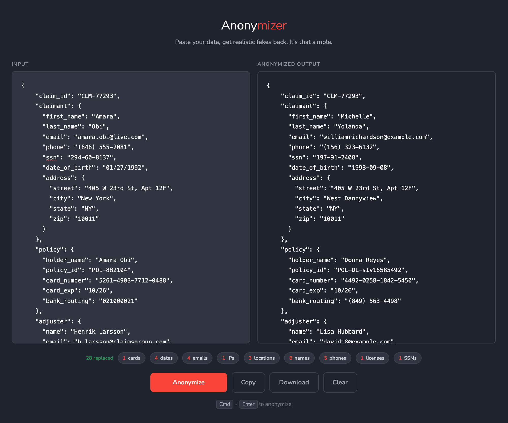

# Anonymizer

A web app that replaces PII with realistic fake data. Paste in text or JSON containing personal information, get back an identical structure with every name, email, phone number, SSN, and credit card swapped for a convincing fake.



## What it catches

- Names (first, last, full — including partial NER matches)
- Email addresses
- Phone numbers (preserves format)
- Social Security numbers
- Credit card numbers (preserves delimiter style)
- IP addresses
- Dates
- Locations / cities
- URLs
- Bank routing numbers
- IBANs
- Driver's license numbers

## What it preserves

- JSON keys and structure
- US state abbreviations
- Zip codes
- ID fields (e.g. `INC-44821`, `EMP-00847`)
- Card expiration MM/YY format
- Consistent mapping — the same input value always produces the same fake within a single request

## Quick start

```bash
# Install dependencies
pip3 install flask presidio-analyzer presidio-anonymizer faker spacy
python3 -m spacy download en_core_web_lg

# Run
python3 app.py
```

Open [http://localhost:5001](http://localhost:5001).

## How it works

The backend uses [Microsoft Presidio](https://github.com/microsoft/presidio) for PII detection and [Faker](https://github.com/joke2k/faker) for generating replacements. On top of Presidio's built-in NER, there are custom recognizers and post-processing rules that:

- Boost detection of SSNs, credit cards, and phone numbers with explicit regex patterns
- Prevent entity spans from crossing newline boundaries
- Protect JSON keys from being anonymized
- Resolve overlapping detections using entity-type priority scoring
- Expand partial name matches to full JSON string values
- Inject synthetic detections for name-typed JSON fields that NER misses
- Filter false positives (IDs with digits, state abbreviations, zip codes misread as dates)

## Features

- **Entity summary** — shows a breakdown of what was found and replaced
- **Download** — export anonymized output as `.txt` or `.json` (auto-detected)
- **Copy** — one-click clipboard copy
- **Clear** — reset both panels
- **Keyboard shortcut** — `Cmd+Enter` / `Ctrl+Enter` to anonymize

## Stack

- Python / Flask
- Presidio Analyzer + spaCy `en_core_web_lg`
- Faker
- Vanilla HTML/CSS/JS frontend

## Limitations

- NER-based name detection isn't perfect — unusual names or names without surrounding context may be missed
- Street addresses are partially caught (city/state) but street lines are not always detected
- Unstructured PII like account numbers or custom ID formats won't be caught unless they match a known pattern
- This tool reduces exposure but does not guarantee 100% redaction
